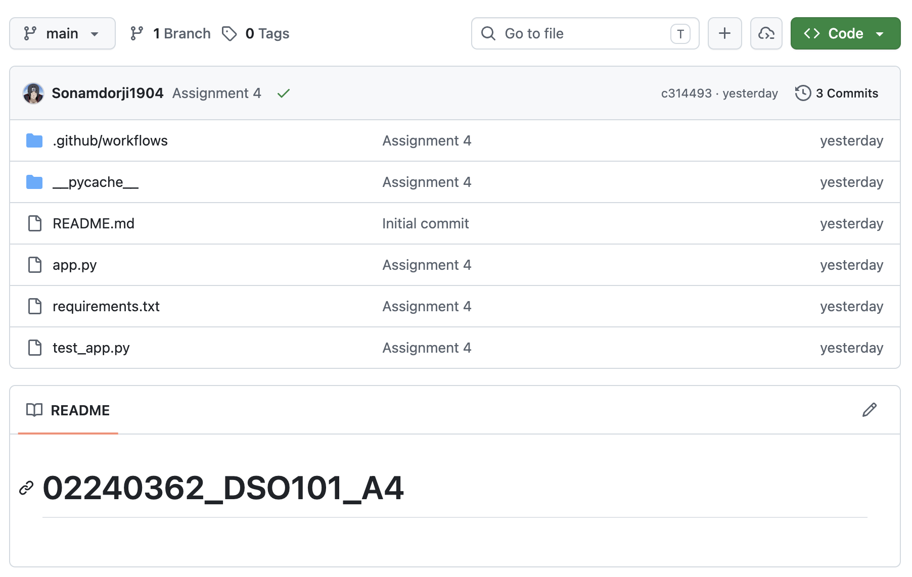
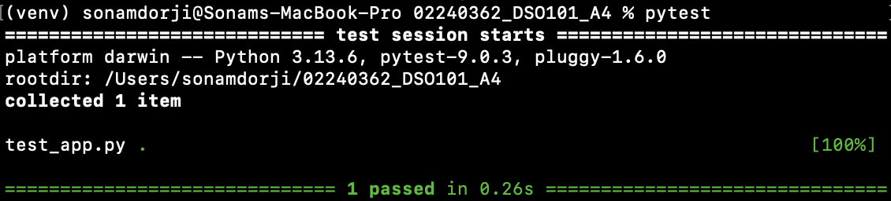
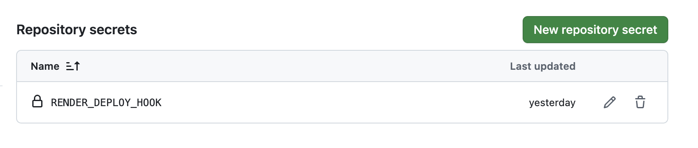
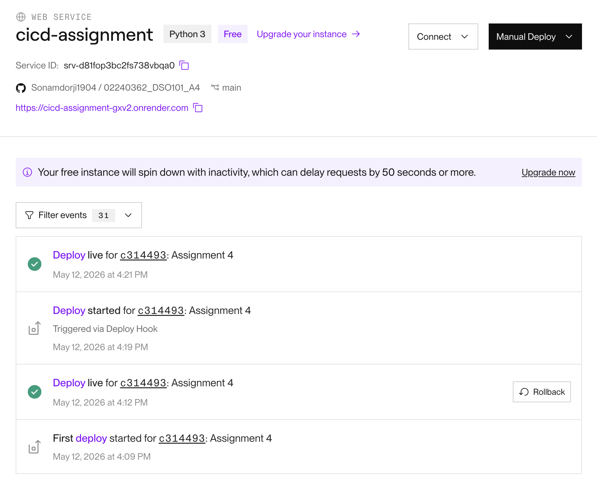
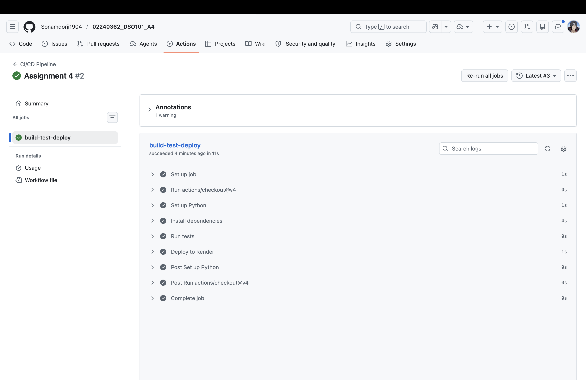

# DSO101 Assignment 4 — Complete CI/CD Pipeline with Testing & Deployment

**Course:** Bachelor's of Engineering in Software Engineering (SWE)  
**Module:** DSO101 — Continuous Integration and Continuous Deployment  
**Submission:** GitHub Repository — `https://github.com/Sonamdorji1904/02240362_DSO101_A4.git`

---

## Table of Contents

- [Objective](#objective)
- [Tools & Technologies](#tools--technologies)
- [Project Structure](#project-structure)
- [Application Setup](#application-setup)
- [Unit Tests](#unit-tests)
- [CI/CD Pipeline](#cicd-pipeline)
- [Render Deployment](#render-deployment)
- [Pipeline Output](#pipeline-output)
- [Challenges Faced](#challenges-faced)
- [Live App URL](#live-app-url)

---

## Objective

Implement a complete real-world DevOps pipeline that covers:

- **Build** — install dependencies and prepare the application
- **Test** — run automated unit tests on every push
- **Deploy** — automatically deploy to Render.com on a successful pipeline run
- **Automation** — zero manual steps from code push to live deployment

---

## Tools & Technologies

| Tool | Purpose |
|------|---------|
| GitHub | Source code hosting |
| GitHub Actions | CI/CD automation |
| Render.com | Cloud deployment (auto-deploy on push) |
| pytest (Python) | Unit testing framework |
| Flask | Backend application runtime |

---

## Project Structure

```
project/
│── app.py                        # Flask backend application
│── test_app.py                   # Unit tests
│── requirements.txt              # Python dependencies
│── .github/
│   └── workflows/
│       └── ci.yml                # GitHub Actions CI/CD pipeline
│── README.md
```

**Screenshot — Repository structure on GitHub:**



---

## Application Setup

### app.py (Flask Backend)

```python
from flask import Flask

app = Flask(__name__)

@app.route("/")
def home():
    return "Hello, CI/CD World!"

if __name__ == "__main__":
    app.run(host="0.0.0.0", port=5000)
```

### requirements.txt

```
flask
pytest
```


---

## Unit Tests

### test_app.py

```python
from app import app

def test_home():
    client = app.test_client()
    response = client.get("/")
    assert response.status_code == 200
    assert b"Hello" in response.data
```

Tests were verified locally before committing:

```bash
pip install -r requirements.txt
pytest
```

**Screenshot — pytest passing locally:**


---

## CI/CD Pipeline

### .github/workflows/ci.yml

```yaml
name: CI/CD Pipeline

on:
  push:
    branches: [ "main" ]

jobs:
  build-test-deploy:
    runs-on: ubuntu-latest

    steps:
    - uses: actions/checkout@v4

    - name: Set up Python
      uses: actions/setup-python@v5
      with:
        python-version: "3.11"

    - name: Install dependencies
      run: pip install -r requirements.txt

    - name: Run tests
      run: pytest

    - name: Deploy to Render
      run: |
        curl -X POST ${{ secrets.RENDER_DEPLOY_HOOK }}
```

---

### GitHub Secrets

The following secrets were added under **GitHub Repository > Settings > Secrets and Variables > Actions**


**Screenshot — GitHub Secrets configured:**



---

## Render Deployment

### Setup Steps

1. Logged into [render.com](https://render.com) and created a new **Web Service**
2. Connected the GitHub repository directly (deploy from Git)
3. Configured the service:
   - **Build Command:** `pip install -r requirements.txt`
   - **Start Command:** `python app.py`
   - **Auto-Deploy:** Enabled (triggers on every push to `main`)
4. Retrieved the **Deploy Webhook URL** from **Service Settings > Deploy Hook**
5. Saved the webhook URL as `RENDER_DEPLOY_WEBHOOK_URL` in GitHub Secrets

**Screenshot — Render service configuration:**



---

## Pipeline Output

### Successful GitHub Actions Run

After pushing to `main`, the pipeline triggered automatically and completed all steps:

- Checkout Repository
- Set up Python 3.9
- Install dependencies (`pip install -r requirements.txt`)
- Run tests (`pytest` — all tests passed)
- Deploy to Render (webhook triggered successfully)

**Screenshot — GitHub Actions workflow run (all steps green):**




---

## Challenges Faced

| Challenge | How It Was Resolved |
|-----------|---------------------|
| `pytest` not found in the pipeline | Added `pytest` explicitly to `requirements.txt` so it is installed in the Actions runner environment |
| Render not redeploying after push | Configured a Render deploy webhook and called it via `curl` in the final GitHub Actions step |
| App crashing on Render due to port binding | Updated `app.run()` to use `host="0.0.0.0"` so Render could bind to the service port correctly |


---

## Live App URL
**Render Deployment:**  [https://cicd-assignment-gxv2.onrender.com](https://cicd-assignment-gxv2.onrender.com)

---

## References

- [GitHub Actions Documentation](https://docs.github.com/en/actions)
- [actions/setup-python](https://github.com/actions/setup-python)
- [pytest Documentation](https://docs.pytest.org/en/stable/)
- [Flask Documentation](https://flask.palletsprojects.com/)
- [Render Deploy Hooks](https://render.com/docs/deploy-hooks)
- [Render — Deploy from Git](https://render.com/docs/github)